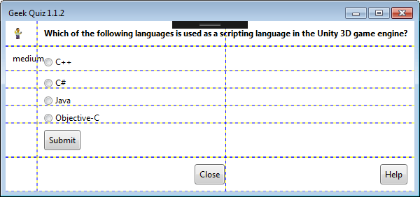
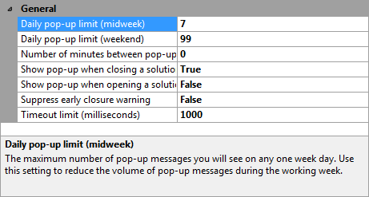

[GitHubRepoURL]: https://github.com/GregTrevellick/Quiz.Launcher
[GitHubRepoIssuesURL]: https://github.com/GregTrevellick/Quiz.Launcher/issues
[GitHubRepoPullRequestsURL]: https://github.com/GregTrevellick/Quiz.Launcher/pulls
[VSMarketplaceUrl]: https://marketplace.visualstudio.com/items?itemName=GregTrevellick.GeekQuiz#review-details
[CharityWareURL]: https://github.com/GregTrevellick/MiscellaneousArtefacts/blob/master/MiscellaneousArtefacts/CharityWare.MD

A trivial [CharityWare][CharityWareURL] extension that poses a geek quiz question when opening the Start Page.

Configurable to also / only pose questions when opening and / or closing a solution.

- Simple escapism from the day to day pressures of software development.

- If you like this ***FREE*** extension, please give it a [review][VSMarketplaceUrl] and/or [help others][CharityWareURL]

- Inspired by [Phil Haack's Encourage](https://marketplace.visualstudio.com/items?itemName=Haacked.Encourage) extension. 

  

### Options

- Configurable frequency of delivery of quiz question 

- Upper limit of quiz questions per day configurable, with different values for midweek and weekends

- Configurable timeout (in milliseconds) for third party data retrieval process 

- Ability to begin quiz when opening start page, opening a solution, closing a solution

  