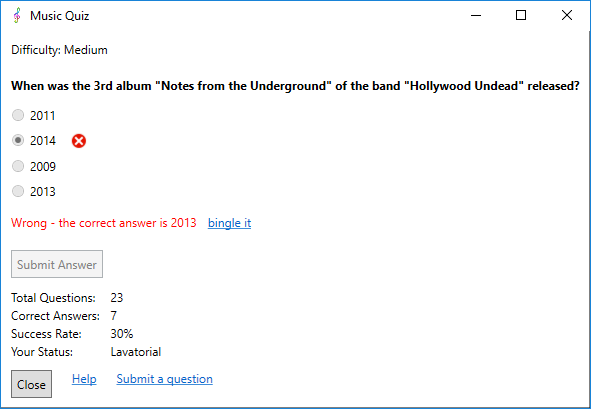
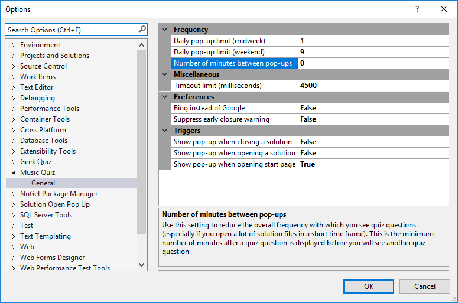

[GitHubRepoURL]: https://github.com/GregTrevellick/Quiz.Launcher
[GitHubRepoIssuesURL]: https://github.com/GregTrevellick/Quiz.Launcher/issues
[GitHubRepoPullRequestsURL]: https://github.com/GregTrevellick/Quiz.Launcher/pulls
[VSMarketplaceUrl]: https://marketplace.visualstudio.com/items?itemName=GregTrevellick.MusicQuiz#review-details
[CharityWareURL]: https://github.com/GregTrevellick/MiscellaneousArtefacts/wiki/Charity-Ware

A daily music quiz in a pop-up window when you open the Start page in Visual Studio.

- Purely for fun, just simple escapism

- If you like this ***FREE*** extension, please give it a [review][VSMarketplaceUrl] and/or [help others][CharityWareURL]

- Inspired by [Phil Haack's Encourage](https://marketplace.visualstudio.com/items?itemName=Haacked.Encourage) extension

  

### Options

- Configurable frequency of delivery of quiz question 

- Upper limit of quiz questions per day configurable, with different values for midweek and weekends

- Ability to begin quiz when opening start page, opening a solution, closing a solution

- Configurable timeout (in milliseconds) for third party data retrieval process 

- Further help available [here](https://github.com/GregTrevellick/Quiz.Launcher/wiki/Options)

  
